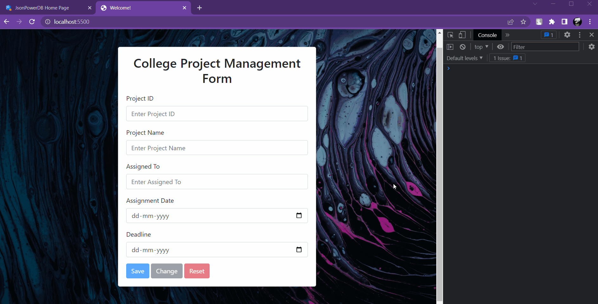

# Project Management Form
> Micro Project Work - Introduction to JsonPowerDB V2.0

## Description
Project Management Form that will store data in **PROJECT-TABLE** relation of **COLLEGE-DB** database

Input Fields: `{Project-ID, Project-Name, Assigned-To, Assignment-Date, Deadline}`

Primary key: `Project ID`

## Built with

- HTML
- Bootstrap
- jQuery
- JSONPowerDB

## Features

1. Data entry form to create and manage project details
2. Primary key field to identify unique records
3. Save button to store new records in the database
4. Update button to edit and update existing records in the database
5. Reset button to clear the form and start over
6. Validation to ensure all fields are filled out correctly
7. Use of JsonPowerDB to store and manage the project data
8. Asthetic Bootstrap CSS for a visually appealing form design.

## Installation

Setup JSONPowerDB
- Register here - http://api.login2explore.com:5577/
- Generate *Token* from `Tools > Tokens > Select Type of Token > Connection token` 
- Paste the *Token* in `index.js` replacing
    ```
    var connToken = 'XXXXXXXX|-XXXXXXXXXXXXXXXXX|XXXXXXXX';
    ```

## Usage

